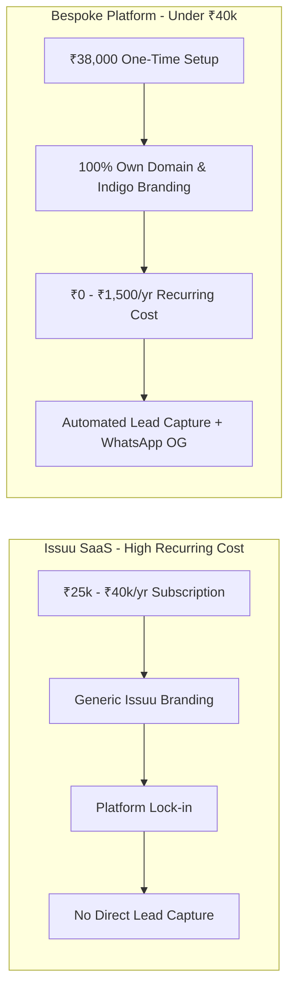
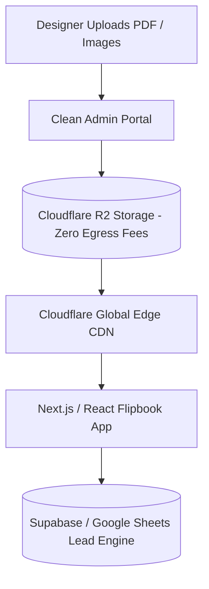

# The "Designer-First" Digital Magazine & Portfolio Platform
## Strategic Proposal & Technical Blueprint (Under ₹40,000)

---

## 1. The Core Strategy: Pitching Unbeatable Value

The client is currently frustrated with Issuu's recurring subscription costs (~₹25,000–₹40,000/year) and limitations. By packaging this as a **one-time investment with near-zero recurring hosting costs**, you provide massive ROI while delivering a bespoke, high-fashion platform.

---

## 2. Ultra "Designer-Friendly" Features (Zero-Friction UX)

Because the client is a creative designer and not a developer, every tool must feel as intuitive as Instagram or Canva:

### 1. Drag-and-Drop Magazine Publisher
* **Automatic Cover Extraction:** When he uploads a PDF, the system automatically extracts Page 1 to use as the high-res 3D magazine cover on the bookshelf.
* **Batch Uploading:** Drag and drop 10–20 PDFs at once; system processes and creates flipbooks in the background.
* **Tagging & Organization:** One-click assignment to categories (*Fashion Week*, *Retail Projects*, *Academic Workshops*, *Monthly Editions*).

### 2. WhatsApp Viral Sharing Engine (Crucial for his 100+ Groups)
* When he shares any magazine or project link on WhatsApp, dynamic **Open Graph (OG) preview cards** generate automatically with the magazine cover, title, and "Read Online" badge.
* Deep-linking: Sharing a link like `domain.com/read/fashion-2026#page-12` opens the flipbook directly to page 12.

### 3. Smart Gated Lead Capture + Instant Sync
* Visitors enter Name, WhatsApp Number, and Email before opening a magazine.
* **Instant Google Sheets Sync:** Every lead is automatically added in real-time to a Google Sheet on the client's phone.
* **WhatsApp Notification / Webhook:** (Optional) Client receives an alert when a high-profile lead accesses his work.

### 4. Pinterest-Style Masonry Image Showcase
* Masonry grid with smooth lightbox viewing for fashion show photos and runway shots.
* Fast lazy-loading with blur-up placeholders for lightning-fast mobile performance.

---

## 3. High-Traffic & Zero-Cost Cloud Architecture

With **100k to 300k monthly views**, standard cloud storage (like AWS S3) can rack up heavy data egress bills. We structure the tech stack so recurring infrastructure costs stay under **₹1,500/year**:

| Layer | Recommended Technology | Monthly Cost | Why This Stack |
| :--- | :--- | :--- | :--- |
| **Frontend & UI** | Next.js / React + Tailwind CSS | **₹0** (Vercel / Netlify Free Tier) | Blazing fast, SEO-ready, mobile-first |
| **Flipbook Engine** | StPageFlip / PDF.js WebGL Engine | **₹0** (Open Source) | Smooth 3D page curl, pinch-to-zoom, swipe |
| **Asset Storage (PDFs & JPEGs)** | Cloudflare R2 (10 GB free + $0.015/GB) | **₹0 - ₹150/mo** | **Zero egress fees** on high bandwidth |
| **Database & Leads** | Supabase / Google Sheets API | **₹0** (Generous free tiers) | Instant lead capture & live sync |
| **Domain & SSL** | Existing `.org` domain + Cloudflare SSL | **~₹1,000 - ₹1,200/yr** (renewal only) | Client owns his domain |

---

## 4. Package Pricing Breakdown (Proposed: ₹38,000)

| Deliverable | Details | Value |
| :--- | :--- | :--- |
| **1. Bespoke Editorial Website** | 5 Core Pages: Home, Magazine Shelf, Gallery, Press/Blog, Contact | ₹12,000 |
| **2. Interactive 3D Flipbook Engine** | Custom Issuu replica (Mobile swipe, dual-page desktop, zoom) | ₹10,000 |
| **3. Designer Admin Portal** | Drag-and-drop PDF & Image manager with auto-cover generator | ₹8,000 |
| **4. Gated Lead Generation System** | Lead gate modal + Google Sheets live sync + analytics tracker | ₹4,000 |
| **5. WhatsApp Viral Card Generator** | Auto-generating rich preview cards for 100+ WhatsApp groups | ₹2,500 |
| **6. Cloud Setup & 1-Year Support** | Cloudflare R2 setup, CDN tuning, domain linkage, handholding | ₹1,500 |
| **Total One-Time Quote** | **Complete All-in-One Solution** | **₹38,000** |

---

## 5. Winning Pitch Script for the Client

> *"Instead of paying Issuu every year for restricted access and generic branding, we are building your own luxury digital publishing platform on your own `.org` domain.*
> 
> *You get a custom-built 3D flipbook reader, an effortless drag-and-drop dashboard where you just drop your PDFs, a Pinterest-style fashion runway gallery, and an automatic lead capture system that sends every viewer's contact directly to your Google Sheet in real time.*
> 
> *Best of all: it is engineered with high-traffic cloud infrastructure so you can share it with 300,000+ students and industry contacts without worrying about server crashes or crazy monthly bills."*
