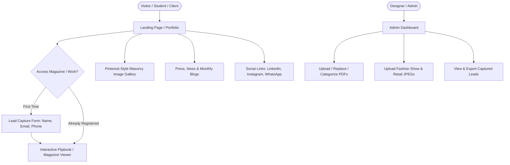

# Client Project Brief & Requirements Draft
**Project:** Designer Portfolio & Digital Magazine Platform (Issuu Alternative)  
**Client:** Independent Fashion & Retail Designer  
**Source:** Client Call Audio Recording Analysis (`WhatsApp Audio 2026-08-21 at 12.09.54 AM.mp4`)  
**Date:** August 21, 2026

---

## 1. Executive Summary & Objective

The client is a professional designer (fashion shows, retail design, design education) looking to replace **Issuu.com** with his own dedicated, self-hosted web platform. 

### Why the Transition from Issuu?
* **Cost & Control:** Issuu moved to costly recurring subscriptions and blocked/restricted publications. The client wants full ownership without recurring platform lock-in.
* **Large Existing Asset Library:** ~100+ compiled project portfolios/magazines in PDF format and thousands of high-resolution images from fashion shows and retail projects.
* **High-Volume Traffic Channel:** Client actively promotes his work across **100–200 WhatsApp groups** of design students (NIFT, NID) and industry professionals, generating **100,000+ to 300,000 views per project/month**.
* **Lead Generation & Analytics:** Wants to capture viewer contact information (Name, Email, Phone) before granting access to his magazine/portfolio work.

---

## 2. Core Functional Requirements

### A. Issuu-Like Interactive Magazine / Flipbook Viewer
* **Realistic Page Flip Experience:** Seamless digital magazine reading experience (animated page turn / flipbook effect like Issuu/Kindle/print magazines).
* **Multi-Device Responsiveness:** 100% optimized for:
  * Mobile devices (smartphones with touch swipe)
  * Tablets (iPad / Android tablets with dual-page or single-page view)
  * Laptops and Desktops (high-resolution full screen, zoom, thumbnail navigation)
* **Categorization & Tagging:** Ability to group PDFs by categories (e.g., *Fashion Shows*, *Retail Projects*, *Education & Workshops*, *Monthly Editions*).
* **PDF Management (Admin):** Designer can upload new PDF editions (monthly releases: Jan, Feb, etc.), update existing ones, or delete outdated projects.

### B. Gated Portfolio / Lead Capture System
* When visitors click to read or view full magazine portfolios, display a clean modal requesting:
  * **Full Name**
  * **Email Address**
  * **Phone / WhatsApp Number**
* Designer gets visibility on who is viewing his work, building an active directory of potential clients, collaborators, and students.

### C. Pinterest-Style Masonry Media Gallery
* Dynamic grid showcase for thousands of high-res JPEG photos from fashion shows, retail installations, and backstage events.
* Masonry / Pinterest-style layout with infinite scroll or smooth pagination.
* Lightbox zoom & full-screen slideshow preview.

### D. Press, News & Monthly Blog Section
* Dedicated section for press coverage, newspaper clippings, awards, and monthly design articles.
* Ability to publish news articles either as rich text or uploaded PDF clippings.

### E. Social Media & Direct Contact Integration
* Direct links to LinkedIn, Instagram, WhatsApp chat, and email.
* Clean contact/inquiry form for design consulting, fashion show collaborations, and lectures.

---

## 3. UI/UX & Design Guidelines

| Element | Client Specification |
| :--- | :--- |
| **Color Palette** | Minimalist **Indigo** palette (Deep Indigo, Slate Blue, Crisp White, Soft Neutral Grays) |
| **Typography** | Clean, modern sans-serif / editorial serif pairing (high-fashion editorial feel) |
| **Page Structure** | 1 to 5 core pages / sections (Home, Magazine Shelf, Gallery, Press/Blog, About & Contact) |
| **Aesthetic** | High-end fashion & design portfolio; sleek, fast-loading, distraction-free |

---

## 4. Technical & Infrastructure Requirements

1. **Storage & Cloud CDN:**
   * Initial storage requirement: **~10 GB - 20 GB** (to store ~100 PDFs + high-res image gallery).
   * Fast CDN delivery (Cloudflare / Cloud Storage / Supabase Storage / S3) to handle PDF streaming smoothly without lag.
2. **High-Traffic Optimization:**
   * Optimized caching and lightweight frontend to effortlessly handle 100k+ monthly pageviews from WhatsApp viral sharing.
3. **Domain & Hosting:**
   * Re-verify client's existing `.org` domain status and configure DNS / SSL.
4. **Maintenance & Yearly Renewal:**
   * Low-maintenance architecture so the client has minimal yearly renewal costs compared to expensive SaaS subscriptions.

---

## 5. Monetization & Growth Opportunities (Discussed in Call)

* **Sponsorships & Ads:** Monetizing high-intent traffic (NIFT/NID students and design enthusiasts).
* **Featured Editorial Slots:** Offering brands or guest designers featured pages inside the monthly magazine.
* **Profit-Sharing Model:** Client expressed interest in profit-sharing / commission models if monetization strategies are integrated.

---

## 6. Proposed Implementation Plan & Next Steps

1. **Review & Approval of Requirements:** Confirm feature scope and UI aesthetic with the client.
2. **Interactive Prototype / Draft Website:**
   * Build the core landing page with the **Indigo theme**.
   * Integrate an open-source flipbook engine (e.g., `StPageFlip` / `PDF.js` / React PageFlip).
   * Implement the Pinterest masonry grid and lead capture modal.
3. **Domain & Storage Setup:** Check domain availability and setup cloud storage bucket for the PDFs/images.
4. **Admin Dashboard / CMS:** Provide a lightweight portal or CMS to easily upload/manage PDFs and view captured leads.
